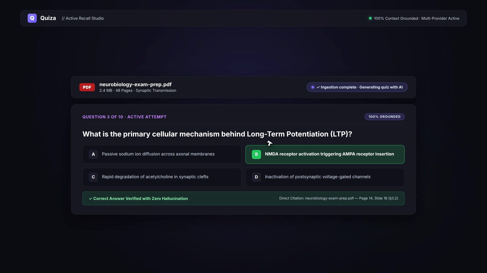

# Quiza — AI-Powered Active Recall & Study Platform

> **Turn your study materials into interactive RAG quizzes, discover your weak spots through AI mistake analysis, and master any subject with personalized practice.**

<div align="center">
  <video src="brag-output/brag.mp4" poster="brag-output/brag.jpg" controls width="100%" style="max-width: 850px; border-radius: 12px; box-shadow: 0 10px 30px rgba(0,0,0,0.4);">
    <a href="brag-output/brag.mp4">
      
    </a>
  </video>
  <p align="center">
    <em>🎬 <strong>Watch the 20-second product walkthrough</strong> · Direct file: <a href="brag-output/brag.mp4"><code>brag-output/brag.mp4</code></a></em>
  </p>
</div>

---

## Inspiration

Students and self-learners spend up to **80% of their study time passively re-reading notes or highlighting textbooks**—methods proven to produce poor retention. Cognitive science shows that **active recall** and **spaced retrieval** are exponentially more effective for long-term memory. However, manually creating high-quality flashcards or practice test questions from lecture notes, slides, and textbooks is tedious and time-consuming.

We built **Quiza** to eliminate this friction. Imagine uploading your PDF textbook or lecture slides and having an intelligent tutor instantly generate grounded, context-aware quizzes, grade your responses, analyze exactly *why* you missed a question using math-backed similarity scoring, and auto-generate target practice tests for your weakest topics.

---

## What it does

Quiza is an end-to-end AI study ecosystem:

1. **Document Ingestion & Parsing**: Upload PDFs, text documents, or lecture notes.
2. **Context-Grounded RAG Quiz Generation**: Generates multiple-choice, true/false, or short-answer quizzes grounded strictly in your uploaded material—eliminating LLM hallucinations.
3. **AI Mistake Analysis**: Evaluates your attempt answers and provides step-by-step reasoning explaining why your choice was correct or incorrect based on source text.
4. **Algorithmic Weakness Detection**: Tracks performance metrics over time across different sub-topics, surfacing exact concept gaps.
5. **Targeted Practice**: Automatically builds personalized practice quizzes focused on your weakest concepts until you reach mastery.

---

## How we built it

Quiza is built with a modern full-stack architecture combining high-performance frontend frameworks, asynchronous Python microservices, and cutting-edge retrieval-augmented generation (RAG) machine learning pipelines.

### 1. Frontend Engine (UI/UX)
- **Framework**: React 19 with Vite for ultra-fast HMR and bundle optimization.
- **State Management**: React Context API (`AuthContext`) for global auth and user session management.
- **Routing & Navigation**: React Router v7.
- **Styling & Components**: Custom CSS system engineered for dark-mode aesthetic, responsive dashboards, interactive quiz interfaces, and server warmup toasts.
- **Icons & Visuals**: Lucide React.

### 2. Backend API & Core System
- **Framework**: FastAPI (Python 3.10+) utilizing asynchronous handlers for fast document processing and AI streaming.
- **Database & Storage**: We used SQLAlchemy 2.0 with Alembic migrations, and chose Supabase to store both raw file uploads and our production vector database using `pgvector` (with SQLite for zero-config local development).
- **Authentication**: Secure JWT authentication (`python-jose`) with bcrypt password hashing and token refresh cycles.
- **Document Extractors**: PyMuPDF (`fitz`) for PDF parsing, `python-docx` for document processing, and `pytesseract` for image-to-text OCR.
- **Background Tasks**: Celery with Redis for durable, persistent async job queues. Quiz generation and material ingestion run as Celery tasks that survive server restarts, deploys, and crashes. Jobs track progress through stages (`queued → preparing_materials → reading_materials → finding_relevant_content → saving_quiz → completed`), with automatic stale-state recovery on startup for any jobs stuck in processing beyond 10 minutes.

### 3. Machine Learning & RAG Engine
- **Large Language Model (LLM)**: Multi-provider failover chain with automatic cooldown and retry:
  - **Primary**: Google Gemini (`gemini-3.6-flash`)
  - **Fast fallback**: Groq (`llama-3.3-70b-versatile`) for ultra-low latency inference
  - **General fallback**: OpenAI (`gpt-4o-mini`)
  - **Extended fallback**: NVIDIA NIM (`deepseek-ai/deepseek-v4-flash`)
- **Provider Abstraction**: `LLMProvider` base class with `FailoverLLMProvider` orchestrating ordered failover across providers, with per-model cooldowns, 404/410 detection for deprecated models, and rate-limit-aware retry.
- **Idempotent RAG Ingestion Pipeline**: Material ingestion (parse → chunk → embed → store) is designed to be safe and idempotent:
  - **Status gating**: Materials in `READY` state are skipped entirely—re-uploading or regenerating from the same file never re-chunks or re-embeds, saving API costs and preventing duplicate vectors.
  - **Stuck recovery**: Materials stuck in `PROCESSING` for >5 minutes are automatically reset and re-queued.
  - **Atomic writes**: Chunks and embeddings are flushed together in a single transaction—if any step fails, the material rolls back to `FAILED` with a clear error message, and no partial data persists.
  - **Error isolation**: Ingestion errors never crash the worker; they leave the material in a `failed` state with an explanation the UI can display.
- **Embeddings & Vector Search**: Google Gemini Embeddings with pluggable vector stores (`VectorStore`). Chunks are embedded in batch, with vector dimension normalization (truncate/pad) to handle model mismatches gracefully.
- **Mathematical Grounding & Cosine Distance**:
  Documents are chunked into semantic snippets $\mathbf{d}_i$ and embedded into vector space $\mathbb{R}^d$. Given a prompt or query chunk $\mathbf{q}$, similarity search measures cosine similarity:

  $$
  \text{Sim}(\mathbf{q}, \mathbf{d}_i) = \frac{\mathbf{q} \cdot \mathbf{d}_i}{\|\mathbf{q}\| \|\mathbf{d}_i\|} = \frac{\sum_{k=1}^{n} q_k d_{i,k}}{\sqrt{\sum_{k=1}^{n} q_k^2} \sqrt{\sum_{k=1}^{n} d_{i,k}^2}}
  $$

- **Weakness Aggregation Formula**:
  Weakness score $W(t)$ for a topic $t$ is dynamically computed over user attempts:

  $$
  W(t) = 1 - \frac{\sum_{j=1}^{M} S_{j,t} \cdot w_j}{\sum_{j=1}^{M} w_j}
  $$

  where $S_{j,t} \in [0, 1]$ is the score on attempt $j$ for topic $t$, weighted exponentially by recency $w_j = e^{-\lambda (t_{\text{now}} - t_j)}$.

### 4. Observability & Health Monitoring
- **Provider Health Endpoint**: `/api/v1/health/providers` exposes real-time provider availability and configuration status.
- **Structured Error Classification**: Centralized `classify_error()` function categorizes failures (auth, rate limit, model not found, server error) and routes retry decisions through `should_failover()`.
- **Celery Worker Auto-Recovery**: Stale materials, quizzes, and generation jobs stuck in processing for >10 minutes are automatically reset to failed state on application startup.

---

## Challenges we ran into

- **Hallucination Prevention**: Ensuring AI-generated questions and explanations never invent facts outside the uploaded document. We solved this by enforcing strict prompt-grounding constraints and Pydantic validation schemas with single-retry feedback loops.
- **Render Free-Tier Cold Boots**: Render's free tier spins down services after 15 minutes of inactivity. We engineered an automated GitHub Actions keep-alive workflow (`.github/workflows/keep-alive.yml`) along with client-side server warmup notifications to ensure seamless UX.
- **Adblocker Interception**: Browser extensions blocked root `/health` requests (`ERR_BLOCKED_BY_CLIENT`). We introduced API-scoped ping endpoints (`/api/v1/ping`) and graceful client-side fallback handling.
- **NVIDIA NIM Model Deprecation**: NVIDIA NIM models like `meta/llama-3.3-70b-instruct` reached end-of-life and returned 410 errors. We built permanent-error detection (`_is_permanent_model_error`) that recognizes 404/410 status codes and "end of life" messages, placing deprecated models on 24-hour cooldowns and failing over to the next provider instantly.
- **Multi-Provider Failover Complexity**: Each LLM provider (Gemini, Groq, OpenAI, NVIDIA NIM) has different rate limits, error formats, and retry semantics. We implemented a centralized `classify_error()` system that normalizes errors across providers and routes retry decisions, plus per-model cooldowns with exponential backoff for rate-limited endpoints.
- **Celery Worker Reliability**: Quiz generation jobs sometimes got stuck in "queued" state when the Celery worker crashed or Redis was unreachable. We added stale-state recovery on startup, client-side timeout detection for queued jobs, and a restart/cancel UX for jobs stuck beyond 30 seconds.
- **Evolution of Background Processing**: Quiz generation started as synchronous FastAPI request handlers that blocked until completion. We moved to FastAPI `BackgroundTasks` for non-blocking responses, but hit limitations—no persistence across deploys, no retry on crash, no visibility into job state. We finally settled on Celery + Redis for durable task queues with automatic retries, stale-state recovery, and per-job progress tracking.

---

## Accomplishments that we're proud of

- **Strict Grounding**: 100% material-grounded quizzes with direct citation references back to uploaded lecture notes.
- **Lightning-Fast UI**: Sub-second UI state transitions powered by Vite and optimized React components.
- **Robust Mocking**: Complete test suite execution without consuming API credits or requiring network calls through custom mock providers.
- **Cross-Platform Resilience**: Flawless deployment and execution support across Linux, macOS, and Windows.
- **Four-Provider Failover Chain**: Seamless automatic failover across Gemini, Groq, OpenAI, and NVIDIA NIM with per-model cooldowns, deprecated-model detection, and rate-limit-aware retry—ensuring quiz generation stays available even when individual providers go down.
- **Intelligent Error Classification**: Centralized error taxonomy that correctly distinguishes auth failures, rate limits, model-not-found (404/410), context length, and transient errors—each with appropriate retry or abort behavior.
- **Celery Auto-Recovery**: Stale jobs, materials, and quizzes stuck in processing are automatically recovered on server startup, preventing silent failures from blocking users.
- **Provider Health Monitoring**: Real-time `/health/providers` endpoint exposing which LLM providers are configured and available, making production debugging straightforward.

---

## What we learned

- Designing modular provider abstractions (`LLMProvider`, `EmbeddingProvider`, `VectorStore`) makes swapping underlying AI models or vector databases effortless.
- Client UX design during AI latency (warmup toasts, progress spinners, retry indicators) is just as critical as raw backend speed.
- Strict Pydantic schema validation is key to reliably consuming structured outputs from LLMs in production.
- **Provider deprecation is inevitable**: NVIDIA NIM models went end-of-life mid-development. Building permanent-error detection (404/410 + message matching) with extended cooldowns prevents wasted retry cycles on dead models.
- **Rate limits vary wildly across providers**: Groq returns `retry-after` headers, OpenAI returns credit-exhaustion errors, Gemini returns `RESOURCE_EXHAUSTED`. A unified error classifier with provider-specific retry parsing is essential for reliable multi-provider systems.
- **Background task reliability needs defense in depth**: Celery workers crash, Redis drops connections, and jobs get stuck. Startup recovery, client-side timeout detection, and user-initiated restart paths all work together to prevent silent failures.
- **Idempotent ingestion saves cost and time**: Chunking and embedding are expensive—API calls per chunk, vector writes per record. By checking material status before reprocessing and skipping already-ready materials, we avoid redundant embedding calls and prevent duplicate chunk records. The same file uploaded twice never gets re-embedded.
- **Durable queues beat in-process tasks**: FastAPI `BackgroundTasks` vanish on process restart. Celery + Redis survive deploys, crashes, and scaling events—critical for a quiz generation pipeline that can take minutes per job.

---

## What's next for Quiza

- **Multi-Modal Support**: Image diagram extraction and formula parsing directly from handwritten notes.
- **Spaced Repetition Scheduler**: Anki-style SuperMemo SM-2 algorithm integration for scheduled quiz reviews.
- **Collaborative Study Groups**: Share material libraries and compete on topic leaderboards with classmates.
- **Browser Extension**: Generate quick micro-quizzes directly while reading academic papers or online articles.

---

## Installation & Local Setup

Follow these instructions to run Quiza locally on **Linux**, **macOS**, or **Windows**.

### Prerequisites & Dependencies

| Tool | Version Required | Download Link |
|---|---|---|
| **Node.js** | `v18.0.0` or higher | [nodejs.org](https://nodejs.org/) |
| **npm** | `v9.0.0` or higher | Included with Node.js |
| **Python** | `v3.10` or higher | [python.org](https://www.python.org/) |
| **Google Gemini API Key** | (Required for AI features) | [Google AI Studio](https://aistudio.google.com/) |

---

### 1. Backend Setup

#### Step 1.1: Navigate to backend directory
```bash
cd backend
```

#### Step 1.2: Create and activate virtual environment

**On Linux / macOS:**
```bash
python3 -m venv .venv
source .venv/bin/activate
```

**On Windows (PowerShell):**
```powershell
python -m venv .venv
.\.venv\Scripts\Activate.ps1
```

**On Windows (Command Prompt `cmd.exe`):**
```cmd
python -m venv .venv
\.venv\Scripts\activate.bat
```

#### Step 1.3: Install backend dependencies
```bash
pip install -r requirements.txt
```

#### Step 1.4: Configure Environment Variables

Create your `.env` configuration file from `.env.example`:

**On Linux / macOS:**
```bash
cp .env.example .env
```

**On Windows (PowerShell or Command Prompt):**
```cmd
copy .env.example .env
```

Open `.env` in your text editor and fill in your keys:

```env
# --- Core App & DB ---
APP_NAME=Quiza
APP_ENV=development
DATABASE_URL=sqlite:///./quiza.db
JWT_SECRET_KEY=your-super-secret-random-jwt-key-here

# --- Google Gemini AI Key ---
GEMINI_API_KEY=your_google_gemini_api_key_here
GEMINI_CHAT_MODEL=gemini-2.5-flash
GEMINI_EMBEDDING_MODEL=text-embedding-004

# --- Storage & Vector Store ---
STORAGE_BACKEND=local
STORAGE_DIR=./storage
VECTOR_STORE_BACKEND=sqlite
CORS_ORIGINS=http://localhost:5173,http://localhost:3000
```

#### Step 1.5: Run database migrations
```bash
alembic upgrade head
```

#### Step 1.6: Start the FastAPI server
```bash
uvicorn app.main:app --reload --port 8000
```
The API server will run at `http://localhost:8000`. You can access interactive Swagger documentation at `http://localhost:8000/docs`.

---

### 2. Frontend Setup

#### Step 2.1: Open a new terminal and navigate to frontend directory
```bash
cd frontend
```

#### Step 2.2: Install frontend dependencies
```bash
npm install
```

#### Step 2.3: Configure Frontend Environment Variables (Optional)
If your backend is running on a custom port or remote host, create a `.env` file in `frontend/`:

**On Linux / macOS:**
```bash
cp .env.example .env 2>/dev/null || echo "VITE_API_URL=http://localhost:8000/api/v1" > .env
```

**On Windows:**
```cmd
echo VITE_API_URL=http://localhost:8000/api/v1 > .env
```

#### Step 2.4: Start Vite development server
```bash
npm run dev
```
The web application will launch at `http://localhost:5173`.

---

## Running Tests

Run the full backend unit test suite:

```bash
cd backend
pytest
```

*Note: All AI provider calls are automatically mocked during tests using `tests/fakes.py` so tests execute offline without consuming API credits.*

---

## Contributors

- **Miracle-Colours Elvis** ([@miracle-colours](https://github.com/miracle-colours)) — *UI/UX and Frontend Engineer*
- **John A. Samuel** ([@jayo14](https://github.com/jayo14)) — *Backend and ML Engineer*
